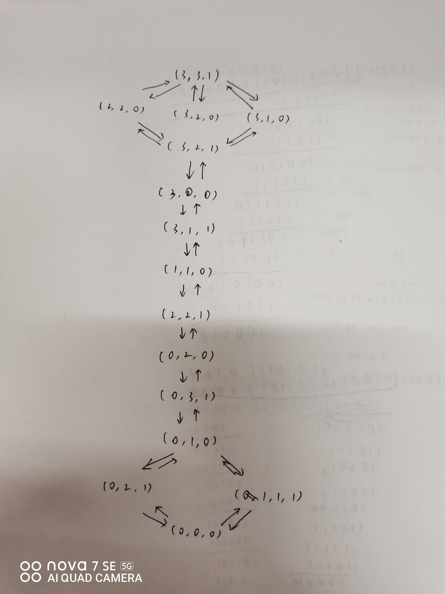

## 3.7
### (a)
初始状态：所有区域都未被染色
目标状态：所有区域都被染色，且相邻区域颜色不同
后继函数：对未被染色的区域进行染色，使其颜色与相邻区域不同
耗散函数：进行染色的次数

### (b)
初始状态：3英尺高的猴子在房子中某个起始点，两个箱子在房子中的某个位置，香蕉被挂在8英尺高的屋顶上
目标状态：猴子拿到香蕉
后继函数：猴子爬上箱子；爬下箱子；将箱子从一个点移动到另一点；猴子从一个点移动到另一点；将箱子堆叠；尝试拿取香蕉
耗散函数：执行的动作次数

### (d)
初始状态：三个水壶都为空
后继函数：将一个水壶装满；将一个水壶倒空；将一个水壶的水倒入另一个水壶，直到另一个水壶装满或者当前水壶为空
目标状态：某个水壶中有刚好一加仑水


## 3.9
### (a)
可以用一个三元组(m,c,b)来表示这一问题的状态。其中m表示河这一边的传教士数量，c表示河这一边的野人数量，b表示船的位置，b=1表示船在这一边，b=0表示船在对岸。
初始状态：(3,3,1)
目标状态：(0,0,0)
后继函数：使m和c分别减1，b从1变为0；使m减2或减1，b从1变为0；使c减2或减1，b从1变为0；使m和c分别加1，b从0变为1；使m加2或加1，b从0变为1；使c加2或加1，b从0变为1。且每次操作后必须满足：m>=c或m=0，且3-m>=3-c或3-m=0，且m和c的值都在0到3之间。
耗散函数：执行的动作次数（船渡河的次数）
完全状态空间图如下：


### (b)
状态空间很小，可以使用简单的BFS解决。用C++实现的算法如下：
```cpp
#include<bits/stdc++.h>
using namespace std;

auto goal_state = tuple<int, int, int>(0, 0, 0);


auto next_states(tuple<int, int, int> state) {
    auto next_states = vector<tuple<int, int, int>>();
    auto [m, c, b] = state;
    if(b == 1) {// 船在这一边
        if(m-1 >= 0 && (m-1 >=c || m-1 == 0) && 3-m+1 >= 3-c) { // 运一个传教士到另一边
            auto next_state = tuple<int, int, int>(m-1, c, 0);
            next_states.push_back(next_state);
        }
        if(c-1 >= 0 && (m >= c-1 || m == 0) && (3-m >= 3-c+1 || 3-m == 0)) { // 运一个野人到另一边
            auto next_state = tuple<int, int, int>(m, c-1, 0);
            next_states.push_back(next_state);
        }
        if(m-1 >= 0 && c-1 >= 0 && (m-1 >= c-1 || m-1 == 0) && (3-m+1 >= 3-c+1 || 3-m+1 == 0)) { // 运一个传教士和一个野人到另一边
            auto next_state = tuple<int, int, int>(m-1, c-1, 0);
            next_states.push_back(next_state);
        }
        if(m-2 >= 0 && (m-2 >= c || m-2 == 0) && 3-m+2 >= 3-c) { // 运两个传教士到另一边
            auto next_state = tuple<int, int, int>(m-2, c, 0);
            next_states.push_back(next_state);
        }
        if(c-2 >= 0 && (m >= c-2 || m == 0) && (3-m >= 3-c+2 || 3-m == 0)) { // 运两个野人到另一边
            auto next_state = tuple<int, int, int>(m, c-2, 0);
            next_states.push_back(next_state);
        }
    }
    else {// 船在另一边
        if(m+1 <= 3 && m+1 >=c && (3-m-1 >= 3-c || 3-m-1 == 0)) { // 运一个传教士到这一边
            auto next_state = tuple<int, int, int>(m+1, c, 1);
            next_states.push_back(next_state);
        }
        if(c+1 <= 3 && (m >= c+1 || m == 0) && (3-m >= 3-c-1 || 3-m == 0)) { // 运一个野人到这一边
            auto next_state = tuple<int, int, int>(m, c+1, 1);
            next_states.push_back(next_state);
        }
        if(m+1 <= 3 && c+1 <= 3 && m+1 >= c+1 && (3-m-1 >= 3-c-1 || 3-m-1 == 0)) { // 运一个传教士和一个野人到这一边
            auto next_state = tuple<int, int, int>(m+1, c+1, 1);
            next_states.push_back(next_state);
        }
        if(m+2 <= 3 && m+2 >=c && (3-m-2 >= 3-c || 3-m-2 == 0)) { // 运两个传教士到这一边
            auto next_state = tuple<int, int, int>(m+2, c, 1);
            next_states.push_back(next_state);
        }
        if(c+2 <= 3 && (m >= c+2 || m == 0) && (3-m >= 3-c-2 || 3-m == 0)) { // 运两个野人到这一边
            auto next_state = tuple<int, int, int>(m, c+2, 1);
            next_states.push_back(next_state);
        }
    }
    return next_states;
}

void BFS_search(tuple<int, int, int> init_state, vector<tuple<int, int, int>> & path) {
    queue<tuple<int, int, int>> q;
    q.push(init_state);
    auto prev = map<tuple<int, int, int>, tuple<int, int, int>>();
    while (!q.empty()) {
        auto state = q.front();
        q.pop();
        if (state == goal_state) {
            break;
        }
        for (auto next_state : next_states(state)) {
            if (prev.find(next_state) != prev.end()) {
                continue;
            }
            prev[next_state] = state;
            q.push(next_state);
        }
    }
    auto state = goal_state;
    while (state != init_state) {
        path.push_back(state);
        state = prev[state];
    }
    path.push_back(init_state);
    reverse(path.begin(), path.end());
    return;
}

int main() {
    auto state = tuple<int, int, int>(3, 3, 1);
    vector<tuple<int, int, int>> path;
    BFS_search(state, path);
    for (auto state : path) {
        auto [m, c, b] = state;
        cout << "(" << m << ", " << c << ", " << b << ")" << endl;
    }
}
```
该程序会输出从初始状态到目标状态的最优解上的所有状态。
检查重复状态是一个好的方法。以我采用的BFS为例，由于状态空间图上有环，如果不检查重复状态（即该状态是否被访问过），那么有可能会陷入死循环。

### (c)
传教士与野人问题在每一个状态上都有10种可能的转换到下一个状态的方式，因此人类会认为这一问题的分支过多，很难解决。但实际上，只有很少的分支是合法的，而人类很难发现这一性质。