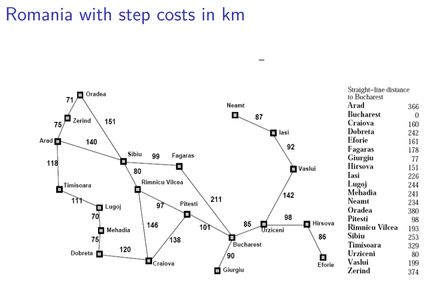
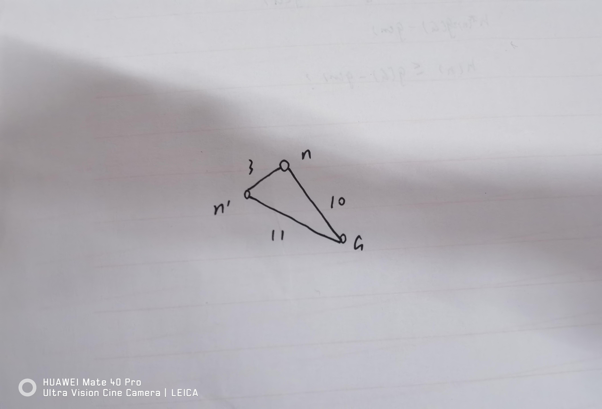

## 4.1

每一层扩展后的队列如下（方括号内从左到右依次为f,g,h）：
- 起点：Lugoj[244=0+244]
- 对Lugoj扩展：Mehadia[311=70+241], Timisoara[440=111+329]
- 对Mehadia扩展：Lugoj[384=140+244], Dobreta[387=145+242], Timisoara[440=111+329]
- 对Lugoj扩展：Dobreta[387=145+242], Timisoara[440=111+329], Mehadia[451=210+241], Timisoara[580=251+329]
- 对Dobreta扩展：Craiova[425=265+160], Timisoara[440=111+329], Mehadia[451=210+241], Mehadia[461=220+241], Timisoara[580=251+329]
- 对Craiova扩展：Timisoara[440=111+329], Mehadia[451=210+241], Mehadia[461=220+241], Pitesti[501=403+98], Timisoara[580=251+329], Rimnicu Vilcea[604=411+193], Dobreta[627=385+242]
- 对Timisoara扩展：Mehadia[451=210+241], Mehadia[461=220+241], Lugoj[466=222+244], Pitesti[501=403+98], Timisoara[580=251+329], Arad[595=229+366], Rimnicu Vilcea[604=411+193], Dobreta[627=385+242]
- 对Mehadia扩展：Mehadia[461=220+241], Lugoj[466=222+244], Pitesti[501=403+98], Lugoj[524=280+244], Dobreta[527=285+242], Timisoara[580=251+329], Arad[595=229+366], Rimnicu Vilcea[604=411+193], Dobreta[627=385+242]
- 对Mehadia扩展：Lugoj[466=222+244], Pitesti[501=403+98], Lugoj[524=280+244], Dobreta[527=285+242], Lugoj[534=290+244], Dobreta[537=295+242], Timisoara[580=251+329], Arad[595=229+366], Rimnicu Vilcea[604=411+193], Dobreta[627=385+242]
- 对Lugoj扩展：Pitesti[501=403+98], Lugoj[524=280+244], Dobreta[527=285+242], Mehadia[533=292+241], Lugoj[534=290+244], Dobreta[537=295+242], Timisoara[580=251+329], Arad[595=229+366], Rimnicu Vilcea[604=411+193], Dobreta[627=385+242], Timisoara[662=333+329]
- 对Pitesti扩展：Bucharest[504=504+0], Lugoj[524=280+244], Dobreta[527=285+242], Mehadia[533=292+241], Lugoj[534=290+244], Dobreta[537=295+242], Timisoara[580=251+329], Arad[595=229+366], Rimnicu Vilcea[604=411+193], Dobreta[627=385+242], Timisoara[662=333+329], Craiova[701=541+160]

## 4.2
$f(n)=(2-\omega)(g(n)+\frac{\omega}{2-\omega}h(n))$。前面的参数$(2-\omega)$不会影响搜索结果，因此只需考虑$g(n)+\frac{\omega}{2-\omega}h(n)$。
- 当$0 < \omega \le 1$时，只要$h(n)$是admisible的，那么$\frac{\omega}{2-\omega}h(n)\le h(n)$也是admisible的，因此是最优的。
- 当$\omega=0$时，这就是一个uniform-cost search，也是最优的。
- 当$\omega>1$时，无法保证最优。

当$\omega=0$时，这个算法是uniform-cost search；当$\omega=1$时，是A* search；当$\omega=2$时，是greedy best-first search。

## 4.6
取$h(n)$为$4*h_1(n)$，即4倍的错位棋子数，可以使它有时估计过高。在 \[[2, 8, 3], [1, 6, 4], [7, 0, 5]] -> \[[2, 1, 3], [4, 5, 6], [7, 8, 0]]时会导致次优解。这种情况下最优解需要19步，而$h(n)=4*h_1(n)$对起始状态进行计算得到$h=20$，估计过高。且计算得到的次优解为23步。

设$h(n)\le h^*(n)+c$，其中$h^*(n)$是完全精确的估计函数。$G_1$是最优解，$G_2$是一个次优解，且$g(G_2) > g(G_1)+c$。n是从起点到最优解路径上的任意一个节点。则：
$$
\begin{aligned}
f(n) &= g(n) + h(n) \\
&\le g(n) + h^*(n) + c \\
&=g(G_1) + c\\
&< g(G_2)\\
\end{aligned}
$$
因此$G_2$不会在$G_1$前被扩展。

## 4.7
考虑任意一个节点n，它到目标G的最短路径上的节点数目（除去n本身）为k。$h(n)$是一个一致的启发式。
当k=1，G是n的直接后继。则$h(n) \le c(n,a,G) + h(G) = h^*(n)$。
若k=m时，有$h(n) \le h^*(n)$，则当k=m+1时，$h(n) \le c(n,a,n')+h(n') \le c(n,a,n')+h^*(n')=h^*(n)$。其中$n'$是$n$到G的最短路径上的直接后继。
由数学归纳法，始终有$h(n) \le h^*(n)$。因此$h(n)$是可采纳的。

给出一个不一致但可采纳的启发式如下：

对上图中的情况，显然$h^*(n)=10, h^*(n')=11$。如果$h(n)=8, h(n')=4$，那么容易验证$h$是可采纳的。但对于n有$h(n) > 3 + h(n')$，其中3是从$n$到$n'$的代价，因此$h$是不一致的。