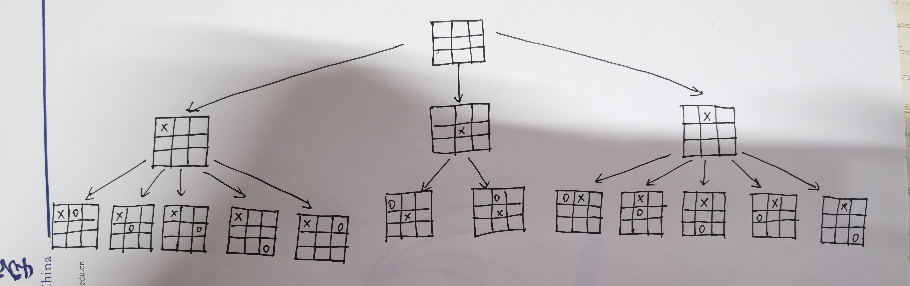
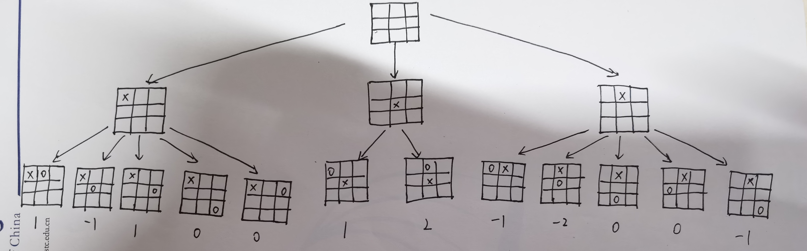
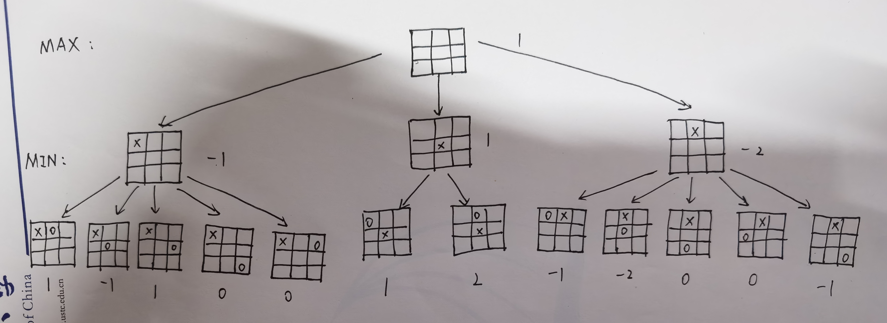
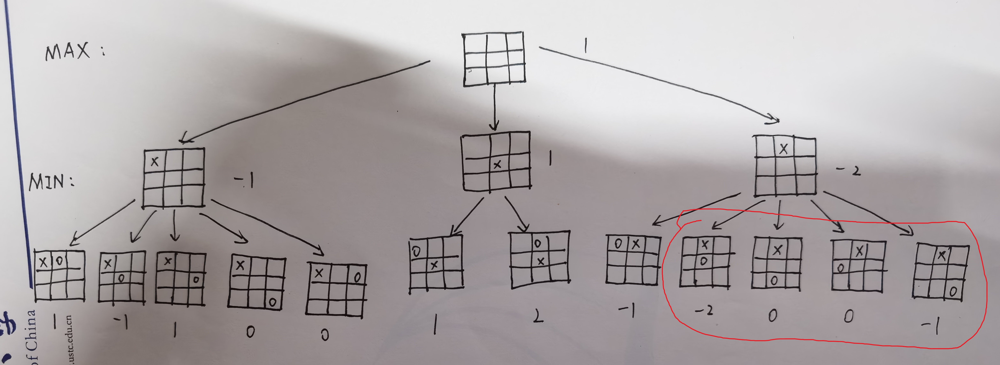
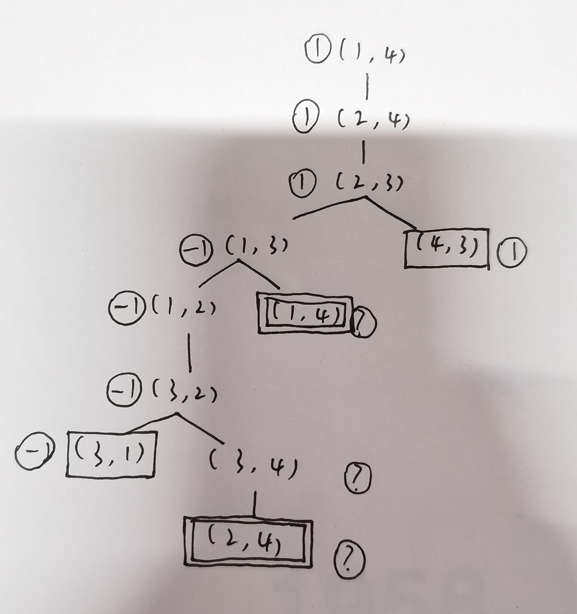

## 5.9
### a.
一共9步棋，第一步有9种走法，第二步有8种走法，第三步有7种走法，以此类推，第九步有1种走法，所以一共有9!种走法。实际上的棋局数可能比这个少一些，但大致在这个数量级。

### b.
如图：

### c.
如图：

### d.
如图：

最优起始行棋是在中间下一步。

### e.
如图，按左中右的顺序遍历，红圈圈起来的会被剪枝：

## 5.8
### a. b.
如图：

对于?值，分以下2种情况处理：
- MAX节点：如果是max(1, ?)，则显然取最大值1，否则最大值由?决定，取?。
- MIN节点：如果是min(-1, ?)，则显然取最小值-1，否则最小值由?决定，取?。

### c.
标准的minimax算法会深度优先地遍历博弈树，只有在遇到了叶子节点时才会回溯。但这一问题遍历的并不是严格意义上的博弈树，其中有环，因此minimax算法会陷入死循环。
解决方法是记录已经遍历过的节点，遇到已经遍历过的节点时将它的值记为?然后返回，?值的处理见上一问。
这一方法并不总是有效，如果某一问题的博弈树上出现min(1, ?)或是max(-1, ?)这样的情况，那么?值可能会被一直传递到根节点，导致无法得到最终结果。

### d.
#### 当n为偶数：
上面的讨论已经证明：当n=4时A一定能取胜。
假设当对所有大于2且小于等于2k的偶数n，A一定能取胜，则当n=2k+2时：
开始时的两步一定是A向右一步，B向左1步，即到达状态(2, 2k+1)。此时A采取的策略是决不退回到位置1（这是可以做到的，因为唯一一种需要A后退的情况是(2k+1, 2k+2)，这里A也只需退回到位置2k，而不是1）。
那么如果后续过程中B也不退回位置2k+2，那么这一问题就变成了n=2k的情况：只要A在B到达位置1之前先到达2k+1，那么A下一步就能取胜。由于n=2k时A会胜利，所以A会先到达2k+1，A一定会胜利。
如果中间某一步B退回了位置2k+2，那么考虑此时A的位置。由于**轮到A行动时，A和B之间的距离一定是偶数**（之前的行动中双方要么同时靠近，即距离减2，要么一方后退一方前进，距离不变），所以只有2种情况：A和B之间距离为0，或距离大于等于2且为偶数。
- 若AB间距离为0，此时状态为(2k+1, 2k+2)，A只需后退一步到(2k, 2k+2)，此时B只能前进一步到(2k, 2k+1)，A下一步跳过B即可取胜。
- 若AB间距离大于等于2且为偶数，设此时A的位置为2m+1，那么同样地，只要A决不退回到2m+1左边的位置，那么这一问题就化为n=2k-2m+2的一个子问题。由于前面已经说明A不会回到位置1，因此m>0，此时A一定会取胜。

综上，由数学归纳法可知，对所有大于2的偶数n，A一定能取胜。

#### 当n为奇数：
显然，n=3时A一定会取胜。
与n为偶数时类似，假设对于所有大于2且小于等于2k+1的奇数n，B一定能取胜，那么当n=2k+3时：
同样地，开始时的两步一定会到达状态(2, 2k+2)，此时B采取的策略是决不退回到2k+3。类似n为偶数时可知，若A也不退回1，则此时变为n=2k+1的情况，B一定会取胜。
如果A退回到1，同样可以推知，轮到A行动时，AB间距离一定为奇数。类似可知，只要B不再退回它现在所在位置的右边的位置，这一问题也可化为n<2k+3的一个子问题，B一定会取胜。

综上，由数学归纳法可知，对所有大于2的奇数n，B一定能取胜。

## 5.13
### a.
类似地，我们有：$n_2 = max(n_3. n_{31}, ..., n_{3b_3})$，因此$n_1 = min(max(n_3. n_{31}, ..., n_{3b_3}), n_{21}, n_{2b_2})$。只要不断替换$n_i$，就可以得到以$n_j$表示的$n_1$的表达式。

### b.
$n_1 = min(l_2, n_2, r_2) = min(l_2, max(l_3, n_3, r_3), r_2)$，同样地只需不断替换$n_i$即可得到包含$min(l_j, n_j, r_j)$的表达式（由于$n_j$是max节点，因此它的上层是min节点）。

### c.
由于$n_j$是max节点，因此会被取$min(l_j, n_j, r_j)$，$n_j$必须小于$l_j$。同理可得$n_j$不能超过$min(l_2, l_4, ..., l_j)$。
同样地，由于在$j-1$层会有$max(l_{j-1}, min(l_j, n_j, r_j), r_{j-1})$，$n_j$不能小于$l_{j-1}$，同理可得$n_j$不能小于$max(l_3, l_5, ..., l_{j-1})$。

### d.
同理，对于min节点$n_k$，$n_k$不能小于$max(l_3, l_5, ..., l_k)$，不能超过$min(l_2, l_4, ..., l_{k-1})$。