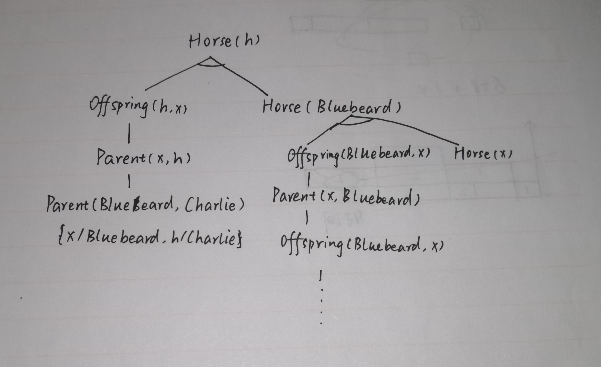

## 8.24
词汇表有：
isStudent(x): x是学生
take(x, y, t): x在时间t上了y课程
pass(x, y, t): x在时间t通过了y课程
x=y: x等于y
Score(x, y, t): x在时间t上y课程的成绩
x>y: x大于y
isPerson(x): x是人
isInsurance(x): x是保险
buy(x, y): x买了y
isSmart(x): x是聪明的
isExpensive(x): x是昂贵的
isAgent(x): x是代理人
sell(x, y, z): x卖了y给z
isBarber(x): x是理发师
isMan(x): x是男人
shave(x, y): x给y刮胡子
born(x, y): x出生在y
isParent(x, y): x是y的父母
isCitizen(x, y, z): x以形式z（如生来就是，或血统上是）作为y的公民
isResident(x, y): x是y的永久居留者
isPolitician(x): x是政治家
fool(x, y, t): x在时间t愚弄了y
### a
$\exist x\ \ \ isStudent(x) \bigwedge take(x, French, 2001Spring)$

### b
$\forall x, t\ \ \ isStudent(x)\bigwedge take(x, French, t) \rightarrow pass(x, French, t)$

### c
$(\exists x\ \ \ isStudent(x) \bigwedge take(x, Greek, 2001Spring))\bigwedge(\forall x, y\ \ \ isStudent(y)\bigwedge take(y, Greek, 2001Spring) \bigwedge isStudent(z) \bigwedge take(z, Greek, 2001Spring) \rightarrow y=z)$

### d
$\forall t, \exist x, \forall y\ \ \ Score(x, Greek, t) > Score(y, French, t)$

### e
$\forall x, y\ \ \ isPerson(x)\bigwedge isInsurance(y)\bigwedge buy(x, y) \rightarrow isSmart(x)$

### f
$\forall x, y\ \ \ \neg(isPerson(x)\bigwedge isInsurance(y)\bigwedge isExpensive(y)\bigwedge buy(x, y))$

### g
$\exist a, \forall x, y\ \ \ isAgent(a)\bigwedge (isInsurance(y) \bigwedge sell(a, y, x)\rightarrow \forall z(isInsurance(z) \rightarrow \neg buy(x, z)))$

### h
$\exist x, \forall z(isBarber(x) \bigwedge (isMan(z)\bigwedge\neg shave(z, z)\rightarrow shave(x, z)))$

### i
$\forall x \ \ \ isPerson(x)\bigwedge born(x, UK)\bigwedge (\forall y \ \ \ isParent(y, x)\rightarrow (\exist t\ \ \ isCitizen(y, UK, t)\bigvee isResident(y, UK)))\rightarrow isCitizen(x, UK, byBirth)$

### j
$\forall x\ \ \ isPerson(x) \bigwedge \neg born(x, UK) \bigwedge(\forall y \ \ \ isParent(y, x)\rightarrow isCitizen(y, UK, byBirth))\rightarrow isCitizen(x, UK, byDescent)$

### k
$\forall x\ \ \ isPolitician(x) \rightarrow (\exist y, \forall t\ \ \ isPerson(y)\bigwedge fool(x, y, t))\bigwedge(\exist t, \forall y \ \ \ isPerson(y)\rightarrow fool(x, z, t))\bigwedge \neg(\forall y, t\ \ \ isPerson(y)\rightarrow fool(x, y, t))$

## 8.17
相邻关系是对称的，而这一定义不具有对称性。例如按这一定义，[1, 2]和[1, 3]是相邻的，但[1, 3]和[1, 2]不是相邻的。

## 9.3
b和c都是合法结果。a引入了出现过的常量，所以不正确。

## 9.4
### a
{x/A, y/B, z/B}

### b
不存在。

### c
{x/John, y/John}

### d
不存在。

## 9.6
### a
$Horse(x) \rightarrow Mammal(x)$
$Cow(x) \rightarrow Mammal(x)$
$Pig(x) \rightarrow Mammal(x)$

### b
$Offspring(y, x) \bigwedge Horse(x) \rightarrow Horse(y)$

### c
$Horse(Bluebeard)$

### d
$Parent(Bluebeard, Charlie)$

### e
$Parent(x, y) \rightarrow Offspring(y, x)$
$Offspring(x, y) \rightarrow Parent(y, x)$

### f
$Mammal(x) \rightarrow Parent(F(x), x)$

## 9.13
### a
如图：

### b
由于$isOffspring(y, x) \bigwedge isHorse(x) \rightarrow isHorse(y)$的位置在$isHorse(Bluebeard)$前面，因此在证明$Horse(Bluebeard)$时会陷入无限递归。如果将它们的顺序换一下，很快就可以得到解$\{h/Bluebeard\}$

### c
可以得到两个解：$Horse(Bluebeard)$和$Horse(Charlie)$。