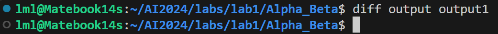

# <center> Lab 1 Report </center>
## Astar搜索
### 启发式函数
采用的启发式函数是曼哈顿距离。

该问题中，影响最终路径的主要因素有两个：障碍物和体力（或者补给点的位置）。然而，要在启发式函数中考虑这两个因素并不容易。障碍物和补给点的位置和数量是随机的，要在计算启发式时考虑这两个因素，往往需要对地图进行遍历，这样可能反而导致复杂度增加。因此，最终采用曼哈顿距离作为启发式函数。

曼哈顿距离显然是consistent的。证明在介绍完算法思路后给出。

### 算法的主要思路
主要需要解决的问题有2个：对障碍物的处理和对体力的处理。

对障碍物的处理比较简单。因为每次只能移动一格，因此只需要判断相邻的4格是否是障碍物即可。

对体力的处理是一个难点。在不需要考虑体力的情况下，我们可以用地图上的坐标唯一地标记搜索路径上的每一个节点（因为我们希望找到最短路径，仅仅只有障碍物的情况下，最短路径不会经过重复的位置）。但在同时有体力限制和障碍物限制时，可能为了满足这两个条件不得不需要经过重复的位置（比如下面这个例子）。
```
5 4 3
1 1 4 1
1 1 0 1 
1 2 0 1
1 1 0 1
1 1 3 1
```

经过观察容易发现，在最短路径上，只有不得不补充体力时才可能经过重复的位置，因此在两次经过同一个位置时，体力值一定会发生变化，否则这一行动没有意义。因此我们可以将体力值作为搜索节点的第3个维度，在按体力值分层的图中进行搜索，即可解决这一问题。

下面给出我的算法实现的伪代码：

```
init open_list and closed_list

init (x, y, t) as init_search_cell, where x and y are the position of starting point, t is the maximal energy

init_search_cell.g=0, init_search_cell.h = Heuristic_Funtion(init_search_cell)

push init_search_cell into open_list

end_cell = null

while open_list is not empty:
    find current_cell with minimum g+h from open_list
    if current_cell is the destination
        end_cell = current_cell
        break
    if current_cell.t == 0:
        continue
    for each available neighbor of current_cell:
        if neighbor is supply point:
            neighbor.t = maximal_energy
        else:
            neighbor.t = current_cell.t - 1
        if neighbor not in open_list and neighbor not in closed_list:
            neighbor.g = current_cell.g + 1
            neighbor.h = Heuristic_Funtion(neighbor)
            neighbor.parent = current_cell
        else if neighbor in open_list and neighbor.g > current_cell.g+1:
            neighbor.g = current_cell.g + 1
            neighbor.h = Heuristic_Funtion(neighbor)
            neighbor.parent = current_cell
        else if neighbor in closed_list and and neighbor.g > current_cell.g+1:
            neighbor.g = current_cell.g + 1
            neighbor.h = Heuristic_Funtion(neighbor)
            neighbor.parent = current_cell
            move neighbor from closed_ilst to open_list
    remove current_cell from open_list
    add current_cell to closed_list
```
其中，判断neighbor是否在open_list或closed_list的条件是，在对应的list中查找是否有和neighbor的横纵坐标和体力值均相同的节点（即按横纵坐标和体力值3个维度查找），如果有就说明neighbor已在该list中。

另外，在每个搜索节点中均设置了parent域，搜索完成后可以顺着终点的parent域往回搜索，从而得到完整的路径。实际实现时还在节点中保存了到达这个节点时采取的动作。

框架中的open_list采用的是C++标准库中的优先队列，而closed_list采用的是vector。由于算法中有可能需要更新open_list中的节点的g值，而标准库中的优先队列不支持修改队列中的元素，因此我改成了自己实现的小顶堆，可以在修改元素后更新对应元素的位置，且使用了一个map作为索引，方便通过横纵坐标和体力查找节点。closed_list也改成了map以提高查找效率。

### 曼哈顿距离一致性证明
首先，简单描述我们采用的分层图的结构：图的节点有(x, y, t)三个维度，存在从(x1, y1, t1)到(x2, y2, t2)的边，当且仅当：
- (x1, y1)和(x2, y2)两个位置上均没有障碍物
- |x1-x2|+|y1-y2|=1
- t2=t1-1，或t2=max_t且(x2, y2)是补给点
其中t2和t1均非负并小于等于max_t，max_t是体力的最大值。任意一条边的权值（长度）均为1。起点是(x_start, y_start, max_t)，终点是(x_end, y_end, t_end)，其中t_end可以取从0到max_t的任意值。

要证明一致性，只需证明$h(n) \le c(n, a, n') + h(n')$。其中$h(n)$是启发式函数，$c(n, a, n')$是从n经过a到n'的实际代价，$h(n')$是n'的启发式函数值。容易知道，$c(n, a, n')=1$。不妨设$n=(x, y, t)$，$n'=(x', y', t')$，那么有：
$$
\begin{align*}
    h(n)&=|x-x_{end}|+|y-y_{end}|\\
    &= |x-x'+x'-x_{end}| + |y-y'+y'-y_{end}|\\
    &\le |x-x'|+|x'-x_{end}| + |y-y'|+|y'-y_{end}|\\
    &=1+|x'-x_{end}|+|y'-y_{end}|\\
    &=c(n, a, n')+h(n')
\end{align*}
$$

因此，曼哈顿距离是一致的。一致的启发式也一定是可采纳的。这保证了A*算法的正确性。

### 与一致代价搜索比较
使用曼哈顿距离作为启发式函数进行搜索时，用时为0.093秒。使用一致代价搜索（启发式恒为0）时，用时12.554秒。两者得到的最短路径长度相同。可见即使是使用曼哈顿距离这样非常简单的启发式函数，A*算法也能得产生很好的加速效果。


## Alpha-Beta剪枝
### 算法实现
算法主要需要实现这几个部分：棋子动作生成和棋盘更新、评估函数、Alpha-Beta剪枝，并通过调用Alpha-Beta剪枝函数完成棋局。

#### 棋子动作生成和棋盘更新
棋子动作的生成比较简单，每种棋子有它固定的移动规则，遍历所有的可能性即可。只有一点比较特别，由于将帅不能碰面，造成将帅碰面的一方直接判负。而对将帅的移动判断是否碰面比较麻烦，因此我将这一部分判断延迟到评估函数和minimax搜索过程中进行：即一旦将帅碰面，则当前行动方直接获胜（因为是上一次行动方造成这一局面）。

棋盘更新只需根据给定的动作，将棋盘上的棋子位置更新即可。

#### 评估函数
评估函数是搜索的关键。我的评估过程分为下面几步：
- 1. 初始化，将红方分数和黑方分数均设为0。
- 2. 首先检查双方的将帅是否存在，如果一方不存在，则直接返回一个极大值或极小值，表示游戏结束。
- 3. 计算当前每个棋子的位置价值和棋子固定价值（根据框架中给出的棋力评估矩阵和棋子价值评估表），累加到双方的分数中。
- 4. 计算双方下一步行动时能够吃掉的棋子价值，这一部分价值由行棋可能性评估表决定。这一部分分数表示的是对对方棋子造成的威胁。另外，如果当前行棋方存在能够吃掉对面将帅的行动，则同样直接返回一个极大值或极小值，表示游戏结束。
- 5. 返回红方分数减去黑方分数。

#### Alpha-Beta剪枝
Alpha-Beta剪枝的实现基本参照课件中的算法，在实现时针对象棋的规则添加了以下几个过程：
- 若一方的将/帅不存在，则这一方失败，直接返回对应的极大值或极小值，表示游戏结束。
- 若两方将帅见面，则判当前行动方胜利，同样返回一个极大值或极小值，表示游戏结束。
- 在节点中增加最优行动域，寻找最优行动时，会将最优行动存储在当前节点中，以便在根节点处得到最优行动。
Alpha-Beta剪枝过程的伪代码如下：
```
AlphaBeta(node, depth, alpha, beta, isMaxPlayer):
    if depth == 0:
        return evaluation(node)
    if node does not have black king:
        return MAX_VALUE
    if node does not have red king:
        return MIN_VALUE
    if red king and black king meet:
        if isMaxPlayer:
            return MAX_VALUE
        else:
            return MIN_VALUE
    if isMaxPlayer:
        maxEval = MIN_VALUE
        for each move of node:
            child = node after move
            eval = AlphaBeta(child, depth-1, alpha, beta, False)
            if eval > maxEval:
                node.bestMove = move
                maxEval = eval
            alpha = max(alpha, eval)
            if beta <= alpha:
                break
        return maxEval
    else:
        minEval = MAX_VALUE
        for each move of node:
            child = node after move
            eval = AlphaBeta(child, depth-1, alpha, beta, True)
            if eval < minEval:
                node.bestMove = move
                minEval = eval
            beta = min(beta, eval)
            if beta <= alpha:
                break
        return minEval
```
根据上述算法，可以通过depth限制搜索深度，在搜索完成后可以通过根节点的bestMove域得到最优行动。

#### 完成棋局
要完成整个棋局，可以进行人机对弈，也可以让程序自行对弈。为节省时间，我选择了后者（事实上，只要对输入输出稍作修改，即可实现人机对弈。两者的核心代码一致）。

为实现自动对弈，只需让红黑双方不断调用AlphaBeta函数寻找最优行动，再根据该行动更新棋盘即可。在每次行动后，判断是否有一方胜利，若有则结束游戏。由于算法的计算能力有限，面对较复杂的局面时可能很长时间无法结束棋局，因此我设置了一个最大步数，若超过这个步数则直接结束对弈。

另外，由于该算法没有引入随机性，因此只要在对弈中出现重复局面，双方就会一直重复下去。为避免这一情况，我维护了一个历史局面列表，在每次搜索前对当前局面进行判重。如果出现重复，则在优势方行动序列中删除上次采用过的行动，强制让优势方进行其他行动（因为象棋中长将长捉判负，其它情况的重复局面可能判和，这是优势方不愿意看到的）。

对应的伪代码如下：
```
init chessboard
init red_history, black_history
init node using chessboard
score = 0, step = 0
while step < max_step and score > MIN_VAL and score < MAX_VAL:
    if current node in red_history:
        remove corresponding move from node.red_moves
    alphaBeta(node, depth, MIN_VAL, MAX_VAL, True)
    step += 1
    output current node.bestMove
    add current node to red_history
    score = evaluation(node)
    if score == MAX_VAL or score == MIN_VAL:
        break
    update node according to node.bestMove

    if current node in black_history:
        remove corresponding move from node.black_moves
    alphaBeta(node, depth, MIN_VAL, MAX_VAL, False)
    step += 1
    output current node.bestMove
    add current node to black_history
    score = evaluation(node)
    if score == MAX_VAL or score == MIN_VAL:
        break
    update node according to node.bestMove
```

### 运行结果
经过多次测试，我选择深度为5，最大步数为30。在这个设定下，对于给定的10个测试样例，平均5秒左右可给出1步行动。其中对于1到6号测试样例，红方可以在4步内获胜；而7、9、10号样例需要10步以上完成棋局，也均为红方胜；8号样例在采用判重机制前陷入了重复局面，采用判重机制后，红方一直在进行进攻，但未能在30步内获胜。

可以看出，当能够在搜索深度范围内获胜时，红方会直接选择最优行动快速绝杀黑方。当深度不够时，需要的步数相较最优行动会明显增加，这说明评估函数对局面的评估能力有限。尽管如此，双方的行动仍是符合棋盘评估方法的。如双方在有进攻机会后会倾向于进行将军或吃子，这样可以增加自己的分数；当己方的将帅受到威胁时，双方也会优先保护自己的将帅；当其他子力受到威胁时，双方会根据情况选择保护棋子或弃子争先以求将军，来获得更高的分数。

另外，比较有意思的是，部分局面下会出现黑方“自杀”的情况，如对于第10个样例，最后达到下面这个局面：

此时轮到黑方行动，而黑方选择支士，直接输掉了比赛。这是因为即使不“自杀”（那么只能跳马），这一局面下红方也只需4步即可绝杀黑方：
- n 任意行动
- N (2,7) (4,8)
- k (4,9) (4,8)
- N (5,4) (4,6)

这4步后一种可能局面如下：

形成“马后炮”，红方获胜。

而我们的搜索深度为5，因此在黑方选择支士时，它已经预见到当前局面必败。这一情况下所有行动评分相同，而扫描棋盘和生成行动时是按从上到下，从左到右的顺序进行的，因此黑方选择了生成的第一个行动，即支士。

10个样例的运行结果按要求输出到了output路径下的`output_x.txt`文件中，每一行表示红方或黑方的一步行棋，格式与文档中的要求一致，即：
> 一个字符（表示你将要移动的棋子） 一个坐标（表示待移动棋子在移动前的位置） 一个坐标（表示待移动棋子在移动后的位置）

其中坐标用`(x,y)`的形式表示，x为横坐标，y为纵坐标，均从0开始，以棋盘左下角为原点。

### 与不采用剪枝的搜索比较
由于不采用剪枝时，进行深度为5的搜索时间过长，这里用深度为4的结果进行比较。

不采用剪枝时，平均每步需要4.2秒


采用Alpha-Beta剪枝时，平均每部仅需0.26秒，大大提高了搜索效率。


另外，将采用剪枝和不采用剪枝的结果进行比较，发现两者得到的最优行动序列相同。这说明Alpha-Beta剪枝算法的正确性。

上图中，output1目录下是未采用剪枝的结果。