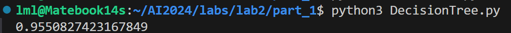
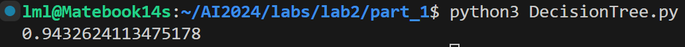
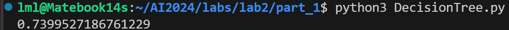
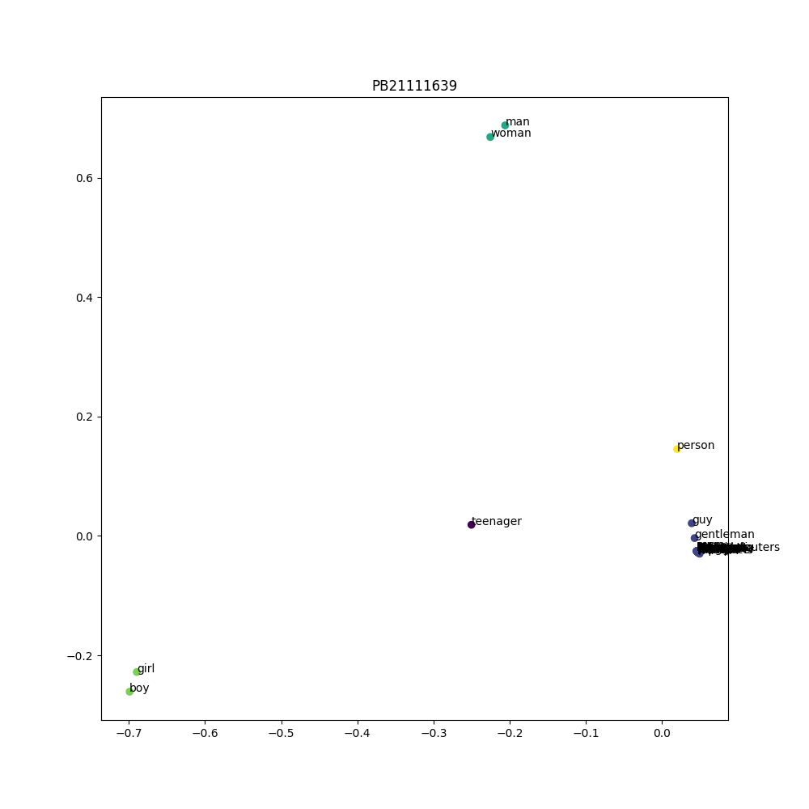
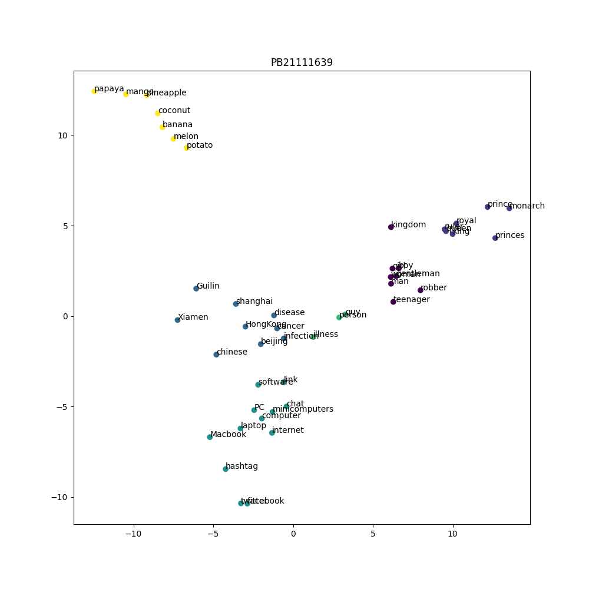
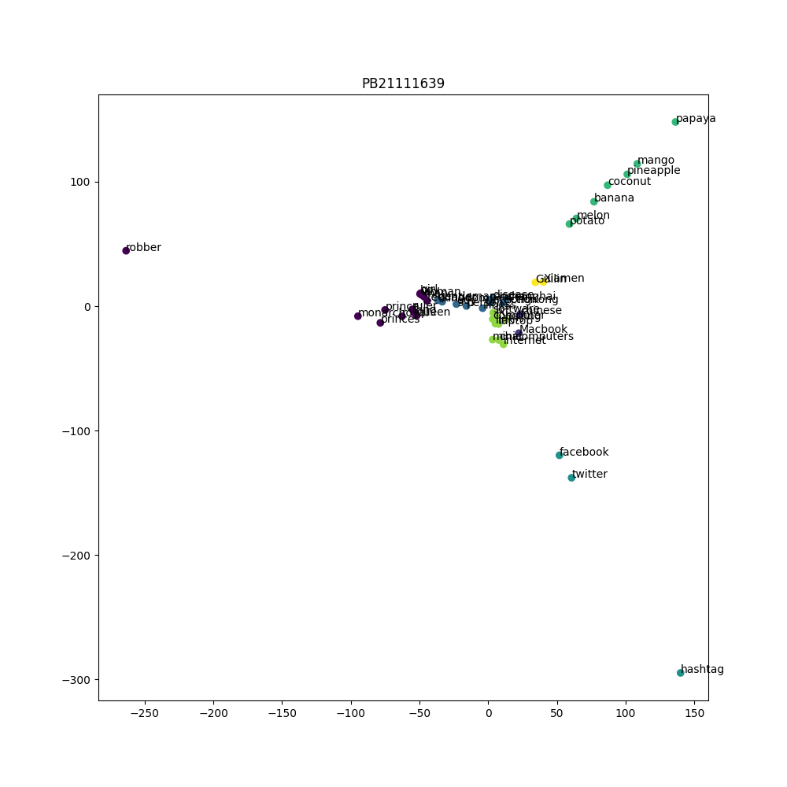
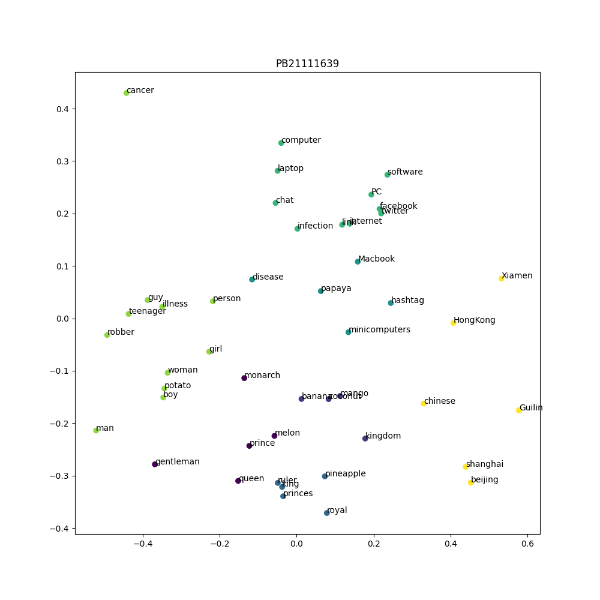
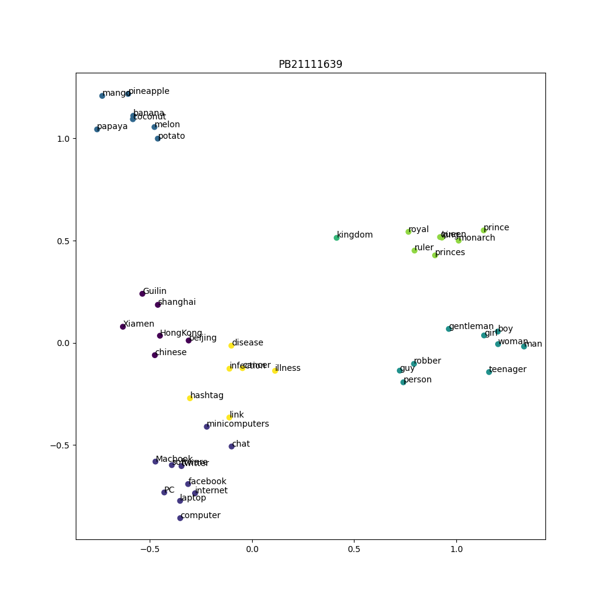

<h1><center>Lab 2 Report</center></h1>

**PB21111639 李牧龙**

## Part 1
### 决策树
#### 算法实现
基本按照实验文档的描述进行实现。
**决策树生成：** 使用一个`tree_generate`函数，从而可以递归地进行决策树的生成。该函数的伪代码如下：
```
定义 tree_generate 函数，接收参数 X, y, A:
    创建一个新的 DecisionTreeNode 节点 node

    如果 y 中所有样本属于同一类别:
        设置 node 的 predicted_class 为 y 的第一个元素
        返回 node

    如果 A 为空 或者 (A 中的特征属于连续特征 且 y 的长度小于分裂阈值):
        设置 node 的 predicted_class 为 y 中出现次数最多的类别
        返回 node

    初始化最佳信息增益和最佳特征 best_feature
    计算 y 的熵 ent_X

    对于 A 中的每个特征 feature:
        如果 feature 属于连续特征:
            计算所有可能的阈值选择（即将X中该特征的值排序后取相邻两个值的中点作为阈值）
            对于 所有可能的阈值 threshold:
                根据 threshold 分割 y，计算熵，更新最佳threshold和最佳信息增益
        否则:
            计算取该特征进行分割后的信息增益，更新最佳信息增益和最佳特征

    设置 node 的 feature_index 为 best_feature
    如果 best_feature 属于连续特征:
        在 node 的 threshold 中添加 best_threshold
        为小于等于和大于 best_threshold 的数据递归调用 tree_generate，生成子节点（特征集A不变）
    否则:
        创建一个新的特征列表 new_A，排除 best_feature
        对于 X 中 best_feature 的每个唯一值 value:
            在 node 的 threshold 中添加 value
            如果对应 value 的 y 为空:
                创建一个新的 DecisionTreeNode 节点 child，设置其 predicted_class 为 y 中出现次数最多的类别
                将 child 添加到 node 的 children 中
            否则:
                递归调用 tree_generate 生成子节点，并添加到 node 的 children 中

    返回 node
```
即对连续变量进行二分划分，且划分后不会将该特征从特征集中删除（下次还可用该特征划分）。离散变量则按课内讲解的方法进行划分。

`fit`函数中只需调用`tree_generate`函数即可。

**决策树预测：** 在`predict`函数中进行预测。该函数比较简单，直接给出代码：
```python
def predict(self, X):
    # X: [n_samples_test, n_features],
    # return: y: [n_samples_test, ]
    y = np.zeros(X.shape[0])
    # TODO:
    for i in range(X.shape[0]):
        row = X.iloc[i]
        node = self.tree
        # 遍历树，找到叶子节点
        while len(node.children) > 0:
            # 连续特征，按二分划分
            if node.feature_index in continue_features:
                if X[node.feature_index].iloc[i] <= node.threshold[0]:
                    node = node.children[0]
                else:
                    node = node.children[1]
            # 离散特征需要比较与其中哪个阈值相等
            else:
                for j in range(len(node.threshold)):
                    if X[node.feature_index].iloc[i] == node.threshold[j]:
                        node = node.children[j]
                        break
        y[i] = node.predicted_class
    return y
```

#### 测试结果
直接运行测试，准确率可以达到95.5\%。推测能达到这么高准确率的原因是数据集中给出了身高和体重，因此预测肥胖是非常容易的。

我还测试了仅使用身高和体重两个特征进行预测的决策树，准确率为94.3\%。

如果去掉身高和体重两个特征，准确率会降低到74.0\%。考虑到一共有7个肥胖等级（即随机预测的准确率只有14.3%），74.0%的准确率已经是一个不错的结果了。


### PCA K-Means
#### 算法实现
**核函数：** 我提供了高斯核，线性核，多项式核，sigmoid核和余弦核。这些核函数的实现如下：
```python
def get_kernel_function(kernel:str):
    # TODO: implement different kernel functions 
    if kernel == "rbf":
        def rbf(x1:np.ndarray, x2:np.ndarray):
            return np.exp(-np.linalg.norm(x1 - x2) ** 2)
        return rbf
    if kernel == 'linear':
        def linear(x1:np.ndarray, x2:np.ndarray):
            return x1.dot(x2)
        return linear
    if kernel == 'poly':
        def poly(x1:np.ndarray, x2:np.ndarray):
            return (x1.dot(x2) + 1) ** 2
        return poly
    if kernel == 'sigmoid':
        def sigmoid(x1:np.ndarray, x2:np.ndarray):
            return np.tanh(x1.dot(x2) + 1)
        return sigmoid
    if kernel == 'cosine':
        def cosine(x1:np.ndarray, x2:np.ndarray):
            return x1.dot(x2) / (np.linalg.norm(x1) * np.linalg.norm(x2))
        return cosine
    return None
```

**PCA算法：** 和实验文档中给出的算法类似，但由于要使用核函数，因此需计算核矩阵，再计算核矩阵的特征值和特征向量。PCA的`fit`和`transform`函数如下：
```python
def fit(self, X:np.ndarray):
    m = X.shape[0]  # 样本数
    # 计算核矩阵
    K = np.zeros((m, m))
    for i in range(m):
        for j in range(m):
            K[i, j] = self.kernel_f(X[i], X[j])
    
    # 中心化核矩阵
    one_n = np.ones((m, m)) / m
    K = K - one_n.dot(K) - K.dot(one_n) + one_n.dot(K).dot(one_n)
    
    # 计算特征值和特征向量
    eig_vals, eig_vecs = np.linalg.eigh(K)
    # 对特征值进行排序
    eig_pairs = [(np.abs(eig_vals[i]), eig_vecs[:, i]) for i in range(m)]
    eig_pairs.sort(key=lambda x: x[0], reverse=True)
    
    # 选取前k个特征向量
    self.alphas = np.column_stack([eig_pairs[i][1] for i in range(self.n_components)])
    
    return self
    

def transform(self, X:np.ndarray):
    # X: [n_samples, n_features]
    # X_reduced = np.zeros((X.shape[0], self.n_components))
    # TODO: transform the data to low dimension
    X_reduced = np.zeros((X.shape[0], self.n_components))
    # 计算降维后的数据
    for i in range(X.shape[0]):
        for j in range(self.n_components):
            X_reduced[i, j] = np.sum(self.alphas[:, j] * np.array([self.kernel_f(X[i], X_k) for X_k in X]))
    return X_reduced
```

**K-Means算法：** 和实验文档中的描述基本一致，给出伪代码如下：
```
初始化k个中心点
for i in range(max_iter):
    计算每个样本到k个中心点的距离，取最近的一个中心点作为该样本的类别
    更新k个中心点，取每个类别的所有向量的算术平均值作为新的中心点
输出每个样本的类别（所属的中心）
```
其中距离的计算使用欧氏距离（即第二范数）。

#### 测试结果
对每一种核函数进行测试，K-Means迭代轮数均为1000轮。结果如下：
**高斯核：**

可以看到结果很差，点全都聚在一起了。

**线性核：**

线性核的结果比高斯核要好很多，大致能够将单词按语义类别分开。

**多项式核：**

效果也不理想，很多点聚在一起。

**Sigmoid核：**

Sigmoid核得到的点比较分散，但是很多不同类别的点混在了一起，导致K-Means无法很好地聚类。

**余弦核：**

余弦核的结果还不错，大体上能够将不同类别的点分开，少部分点分类错误。

## Part 2