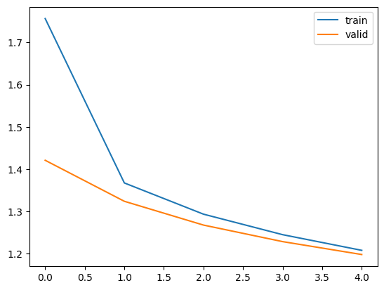
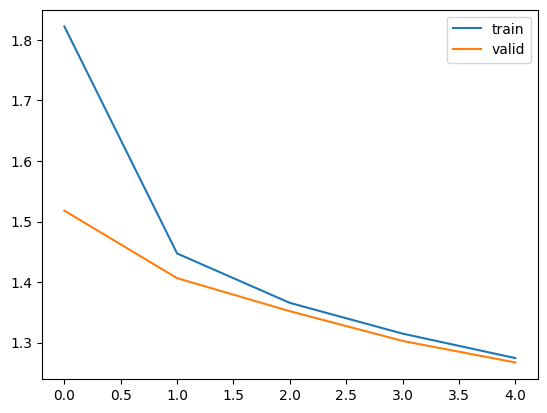

<h1><center>Lab 2 Report</center></h1>

**PB21111639 李牧龙**

## Part 1
### 决策树
#### 算法实现
基本按照实验文档的描述进行实现。
**决策树生成：** 使用一个`tree_generate`函数，从而可以递归地进行决策树的生成。该函数的伪代码如下：
```
定义 tree_generate 函数，接收参数 X, y, A:
    创建一个新的 DecisionTreeNode 节点 node

    如果 y 中所有样本属于同一类别:
        设置 node 的 predicted_class 为 y 的第一个元素
        返回 node

    如果 A 为空 或者 (A 中的特征属于连续特征 且 y 的长度小于分裂阈值):
        设置 node 的 predicted_class 为 y 中出现次数最多的类别
        返回 node

    初始化最佳信息增益和最佳特征 best_feature
    计算 y 的熵 ent_X

    对于 A 中的每个特征 feature:
        如果 feature 属于连续特征:
            计算所有可能的阈值选择（即将X中该特征的值排序后取相邻两个值的中点作为阈值）
            对于 所有可能的阈值 threshold:
                根据 threshold 分割 y，计算熵，更新最佳threshold和最佳信息增益
        否则:
            计算取该特征进行分割后的信息增益，更新最佳信息增益和最佳特征

    设置 node 的 feature_index 为 best_feature
    如果 best_feature 属于连续特征:
        在 node 的 threshold 中添加 best_threshold
        为小于等于和大于 best_threshold 的数据递归调用 tree_generate，生成子节点（特征集A不变）
    否则:
        创建一个新的特征列表 new_A，排除 best_feature
        对于 X 中 best_feature 的每个唯一值 value:
            在 node 的 threshold 中添加 value
            如果对应 value 的 y 为空:
                创建一个新的 DecisionTreeNode 节点 child，设置其 predicted_class 为 y 中出现次数最多的类别
                将 child 添加到 node 的 children 中
            否则:
                递归调用 tree_generate 生成子节点，并添加到 node 的 children 中

    返回 node
```
即对连续变量进行二分划分，且划分后不会将该特征从特征集中删除（下次还可用该特征划分）。离散变量则按课内讲解的方法进行划分。

`fit`函数中只需调用`tree_generate`函数即可。

**决策树预测：** 在`predict`函数中进行预测。该函数比较简单，直接给出代码：
```python
def predict(self, X):
    # X: [n_samples_test, n_features],
    # return: y: [n_samples_test, ]
    y = np.zeros(X.shape[0])
    # TODO:
    for i in range(X.shape[0]):
        row = X.iloc[i]
        node = self.tree
        # 遍历树，找到叶子节点
        while len(node.children) > 0:
            # 连续特征，按二分划分
            if node.feature_index in continue_features:
                if X[node.feature_index].iloc[i] <= node.threshold[0]:
                    node = node.children[0]
                else:
                    node = node.children[1]
            # 离散特征需要比较与其中哪个阈值相等
            else:
                for j in range(len(node.threshold)):
                    if X[node.feature_index].iloc[i] == node.threshold[j]:
                        node = node.children[j]
                        break
        y[i] = node.predicted_class
    return y
```

#### 测试结果
直接运行测试，准确率可以达到95.5\%。推测能达到这么高准确率的原因是数据集中给出了身高和体重，因此预测肥胖是非常容易的。

我还测试了仅使用身高和体重两个特征进行预测的决策树，准确率为94.3\%。

如果去掉身高和体重两个特征，准确率会降低到74.0\%。考虑到一共有7个肥胖等级（即随机预测的准确率只有14.3%），74.0%的准确率已经是一个不错的结果了。


### PCA K-Means
#### 算法实现
**核函数：** 我提供了高斯核，线性核，多项式核，sigmoid核和余弦核。这些核函数的实现如下：
```python
def get_kernel_function(kernel:str):
    # TODO: implement different kernel functions 
    if kernel == "rbf":
        def rbf(x1:np.ndarray, x2:np.ndarray):
            return np.exp(-np.linalg.norm(x1 - x2) ** 2)
        return rbf
    if kernel == 'linear':
        def linear(x1:np.ndarray, x2:np.ndarray):
            return x1.dot(x2)
        return linear
    if kernel == 'poly':
        def poly(x1:np.ndarray, x2:np.ndarray):
            return (x1.dot(x2) + 1) ** 2
        return poly
    if kernel == 'sigmoid':
        def sigmoid(x1:np.ndarray, x2:np.ndarray):
            return np.tanh(x1.dot(x2) + 1)
        return sigmoid
    if kernel == 'cosine':
        def cosine(x1:np.ndarray, x2:np.ndarray):
            return x1.dot(x2) / (np.linalg.norm(x1) * np.linalg.norm(x2))
        return cosine
    return None
```

**PCA算法：** 和实验文档中给出的算法类似，但由于要使用核函数，因此需计算核矩阵，再计算核矩阵的特征值和特征向量。PCA的`fit`和`transform`函数如下：
```python
def fit(self, X:np.ndarray):
    m = X.shape[0]  # 样本数
    # 计算核矩阵
    K = np.zeros((m, m))
    for i in range(m):
        for j in range(m):
            K[i, j] = self.kernel_f(X[i], X[j])
    
    # 中心化核矩阵
    one_n = np.ones((m, m)) / m
    K = K - one_n.dot(K) - K.dot(one_n) + one_n.dot(K).dot(one_n)
    
    # 计算特征值和特征向量
    eig_vals, eig_vecs = np.linalg.eigh(K)
    # 对特征值进行排序
    eig_pairs = [(np.abs(eig_vals[i]), eig_vecs[:, i]) for i in range(m)]
    eig_pairs.sort(key=lambda x: x[0], reverse=True)
    
    # 选取前k个特征向量
    self.alphas = np.column_stack([eig_pairs[i][1] for i in range(self.n_components)])
    
    return self
    

def transform(self, X:np.ndarray):
    # X: [n_samples, n_features]
    # X_reduced = np.zeros((X.shape[0], self.n_components))
    # TODO: transform the data to low dimension
    X_reduced = np.zeros((X.shape[0], self.n_components))
    # 计算降维后的数据
    for i in range(X.shape[0]):
        for j in range(self.n_components):
            X_reduced[i, j] = np.sum(self.alphas[:, j] * np.array([self.kernel_f(X[i], X_k) for X_k in X]))
    return X_reduced
```

**K-Means算法：** 和实验文档中的描述基本一致，给出伪代码如下：
```
初始化k个中心点
for i in range(max_iter):
    计算每个样本到k个中心点的距离，取最近的一个中心点作为该样本的类别
    更新k个中心点，取每个类别的所有向量的算术平均值作为新的中心点
输出每个样本的类别（所属的中心）
```
其中距离的计算使用欧氏距离（即第二范数）。

#### 测试结果
对每一种核函数进行测试，K-Means迭代轮数均为1000轮。结果如下：
**高斯核：**

可以看到结果很差，点全都聚在一起了。

**线性核：**

线性核的结果比高斯核要好很多，大致能够将单词按语义类别分开。

**多项式核：**

效果也不理想，很多点聚在一起。

**Sigmoid核：**

Sigmoid核得到的点比较分散，但是很多不同类别的点混在了一起，导致K-Means无法很好地聚类。

**余弦核：**

余弦核的结果还不错，大体上能够将不同类别的点分开，少部分点分类错误。

## Part 2
### MoE Transformer
#### 算法实现
**编解码：** 即将字符转换为数字，以及将数字转换为字符。
```python
def generate_vocabulary(
    self,
    ):
    self.char2index = {}
    self.index2char = {}
    unique_chars = list(set(self.dataset))
    unique_chars.sort()
    for i, char in enumerate(unique_chars):
        self.char2index[char] = i+1
        self.index2char[i+1] = char
    self.index2char[0] = " "

def encode(
    self,
    sentence : str,
    ) -> torch.Tensor:
    sentence = [self.char2index[char] for char in sentence]
    sentence = [0] + sentence
    return torch.tensor(sentence, dtype=torch.long, device=device)

def decode(
    self,
    tokens : torch.Tensor,
    ) -> str:
    sentence = [self.index2char[index] for index in tokens]
    sentence = sentence[1:]
    return "".join(sentence)
```

**加载数据集：** 这里主要处理的是提取文本和标签。使用python列表的语法可以很方便地实现。
```python
def __getitem__(self, idx):
    chunk = self.encoded[idx:idx+self.chunk_size]
    label = self.encoded[idx+1:idx+self.chunk_size+1]
    return chunk, label
```

**注意力机制：** 按照文档的描述，先计算出Q、K、V，再计算注意力权重，最后计算输出。
```python
class HeadAttention(nn.Module):
    def __init__(self, seq_len:int, embed_size:int, hidden_size:int):
        super().__init__()
        self.register_buffer("tril", torch.tril(torch.ones(seq_len, seq_len)))
        # 初始化三个线性层，分别用于计算Q、K、V
        self.to_q = nn.Linear(embed_size, hidden_size)
        self.to_k = nn.Linear(embed_size, hidden_size)
        self.to_v = nn.Linear(embed_size, hidden_size)

    def forward(self, inputs):
        # 计算Q、K、V
        q = self.to_q(inputs)
        k = self.to_k(inputs)
        v = self.to_v(inputs)
        # 按照公式，使用批量矩阵乘法计算注意力权重
        attn = torch.bmm(q, k.transpose(1, 2)) / (k.size(-1) ** 0.5)
        attn = attn.masked_fill(self.tril == 0, float('-inf'))
        attn = F.softmax(attn, dim=-1)
        return torch.bmm(attn, v)
```

**多头注意力：** 注意力机制已经实现好，多头注意力只需调用多次即可。
```python
class MultiHeadAttention(nn.Module):
    def __init__(self, n_heads:int, head_size:int, seq_len:int, embed_size:int):
        super().__init__()
        head_size = embed_size // n_heads
        # 创建多个注意力头
        self.heads = nn.ModuleList([HeadAttention(seq_len, embed_size, head_size) for _ in range(n_heads)])
        # 创建一个线性层，用于将多个头的输出拼接起来
        self.projection = nn.Linear(n_heads * head_size, embed_size)


    def forward(self, inputs):
        # 对每个头进行计算
        head_outputs = [head(inputs) for head in self.heads]
        # 拼接多个头的输出
        return self.projection(torch.cat(head_outputs, dim=-1))
```

**专家网络：** 两个线性层，先将`embed_size`扩大4倍，在缩小回来。
```python
class Expert(nn.Module):
    def __init__(self, embed_size:int):
        super().__init__()
        # fc1将输入扩大到4*embed_size，fc2将输出缩小回embed_size
        self.fc1 = nn.Linear(embed_size, 4*embed_size)
        self.fc2 = nn.Linear(4*embed_size, embed_size)

    def forward(self, inputs):
        mid = F.relu(self.fc1(inputs))
        return self.fc2(mid)
```

**选通网络：** 用一个线性层计算每一位专家的得分，再使用softmax进行标准化，用`torch.topk`选出前k个专家。
```python
class TopkRouter(nn.Module):
    def __init__(self, embed_size, num_experts, active_experts):
        super(TopkRouter, self).__init__()
        self.embed_size = embed_size
        self.num_experts = num_experts
        self.active_experts = active_experts
        # 一个线性层，用于计算每个专家的得分
        self.fc = nn.Linear(embed_size, num_experts)
        self.softmax = nn.Softmax(dim=-1)

    

    def forward(self, inputs):
        # 计算每个专家的得分，并使用softmax进行标准化
        router_output = self.softmax(self.fc(inputs))
        # 选出前k个专家
        top_values, indices = torch.topk(router_output, self.active_experts, dim=-1)
        return router_output, indices
```

**Sparse MoE：** 让每位专家对输入进行处理，再将结果加权求和。为了方便计算，使用`torch.einsum`进行计算。
```python
class SparseMoE(nn.Module):
    def __init__(self, embed_size:int, num_experts:int, active_experts:int):
        ## TODO
        super(SparseMoE, self).__init__()
        self.num_experts = num_experts
        self.active_experts = active_experts
        self.experts = nn.ModuleList([Expert(embed_size) for _ in range(num_experts)])
        self.router = TopkRouter(embed_size, num_experts, active_experts)

    def forward(self, inputs):
        ## TODO
        # 计算每个专家的权重
        router_output, indices = self.router(inputs)
        # 让每个专家对输入进行处理
        expert_outputs = [expert(inputs) for expert in self.experts]
        # 将专家的输出进行堆叠
        expert_outputs = torch.stack(expert_outputs, dim=1)
        # 使用router的输出对专家的输出进行加权求和
        final_output = torch.einsum('bnte,btn->bte', expert_outputs, router_output)
        return final_output
```

**组建Transformer：** 将上述模块组合成Block，再将多个Block进行堆叠，最后加上一个线性层。
```python
class Block(nn.Module):
    def __init__(self, embed_size:int, n_heads:int, seq_len:int, num_experts:int, active_experts:int):
        super().__init__()
        self.norm1 = nn.LayerNorm(embed_size)
        self.norm2 = nn.LayerNorm(embed_size)
        self.mha = MultiHeadAttention(n_heads, embed_size//n_heads, seq_len, embed_size)
        self.ff = SparseMoE(embed_size, num_experts, active_experts)

    def forward(self, inputs):
        # 计算多头注意力，将其与原输入相加再进行规范化
        x = self.mha(inputs)
        x = self.norm1(x + inputs)
        # 同理，计算专家网络，将其与原输入相加再进行规范化
        x = self.ff(x)
        return self.norm2(x + inputs)

class SparseMoETransformer(nn.Module):
    def __init__(self, vocab_size:int, seq_len:int, embed_size:int, n_layers:int, n_heads:int, num_experts:int, active_experts:int):
        super().__init__()
        self.token_embedding = nn.Embedding(vocab_size, embed_size)
        self.position_embedding = nn.Embedding(seq_len, embed_size)
        self.blocks = nn.ModuleList([Block(embed_size, n_heads, seq_len, num_experts, active_experts) for _ in range(n_layers)])
        self.norm = nn.LayerNorm(embed_size)
        self.norm2 = nn.LayerNorm(vocab_size)
        self.fc = nn.Linear(embed_size, vocab_size)
        self.seq_len = seq_len
        self.vocab_size = vocab_size
        self.embed_size = embed_size

    def forward(self, inputs, labels=None):
        batch_size, seq_len, = inputs.shape
        # 将token embedding和position embedding相加
        embedding = self.token_embedding(inputs) + self.position_embedding(torch.arange(seq_len, device=device))

        # 堆叠多个block
        attens = embedding
        for block in self.blocks:
            attens = block(attens)

        # 最后的线性层
        logits = self.fc(attens)
        logits = self.norm2(logits)
        logits = F.log_softmax(logits, dim=-1)

        # 计算loss，使用交叉熵
        if labels is None:
            loss = None
        else:
            batch_size, seq_len, vocab_size = logits.shape
            logits = logits.view(batch_size * seq_len, vocab_size)
            labels = labels.view(batch_size * seq_len)
            loss = F.cross_entropy(logits, labels)
        return logits, loss
```

**训练循环：** 训练循环中，每次迭代都会计算loss，然后使用反向传播更新参数。验证时不需要反向传播，只需计算loss即可。
```python
def train(model, dataloader, epoch, device):
    # 使用Adam优化器
    optimizer = torch.optim.Adam(model.parameters(), lr=1e-3)
    model.train()
    total_loss = 0
    from tqdm import tqdm
    for i, (inputs, targets) in tqdm(enumerate(dataloader), total=len(dataloader)):
        # 每次迭代都需要清空梯度
        optimizer.zero_grad()
        # 将输入和标签放到GPU上
        inputs = inputs.to(device)
        targets = targets.to(device)
        # 计算输出和loss
        logits, loss = model(inputs, targets)
        # 反向传播
        loss.backward()
        optimizer.step()
        total_loss += loss.item()
        
    print(f'Epoch {epoch} Loss: {total_loss / len(dataloader)}')

    return total_loss / len(dataloader)

def validate(model, dataloader, epoch, device):
    # 和上面一样，但无需优化器和反向传播
    model.eval()
    total_loss = 0
    from tqdm import tqdm
    for i, (inputs, targets) in tqdm(enumerate(dataloader), total=len(dataloader)):
        inputs = inputs.to(device)
        targets = targets.to(device)
        logits, loss = model(inputs, targets)
        total_loss += loss.item()
    return total_loss / len(dataloader)
```

**绘制loss变化：** 使用matplotlib库画图。
```python
import matplotlib.pyplot as plt
# 将得到的train_loss和valid_loss数组传入，即可画出loss变化图
def plot_loss(train_loss, valid_loss):
    plt.plot(train_loss, label='train')
    plt.plot(valid_loss, label='valid')
    plt.legend()
    plt.show()
```

#### 测试结果
模型参数如下：
```python
chunk_size = 50
batch_size = 512
seq_len = 50
embed_size = 64
n_layers = 3
n_heads = 8
num_experts = 8
active_experts = 2
epochs = 5
lr = 0.001
```
生成得到的结果为：
```
I could pick my lance.

KING RICHARD II:
The matter of the princess of the world,
And then the way to the princely servan
```
loss曲线：


可以看到，补写得到的结果均为完整的单词，语法也还可以接受。loss曲线也在逐渐下降，说明模型在训练中逐渐收敛。

上面补写出来的文本中包含空行和人名，可以在样本中去掉这些内容，再进行训练。得到的结果如下：
```
I could pick my lance.
What is the state of the commons of the consuls
With the seas of the world of the commons
That the
```
loss曲线：


最后的句子不完整是因为token数达到了上限。可以看到，去掉了空行和人名后，生成的文本中也没有这些内容。